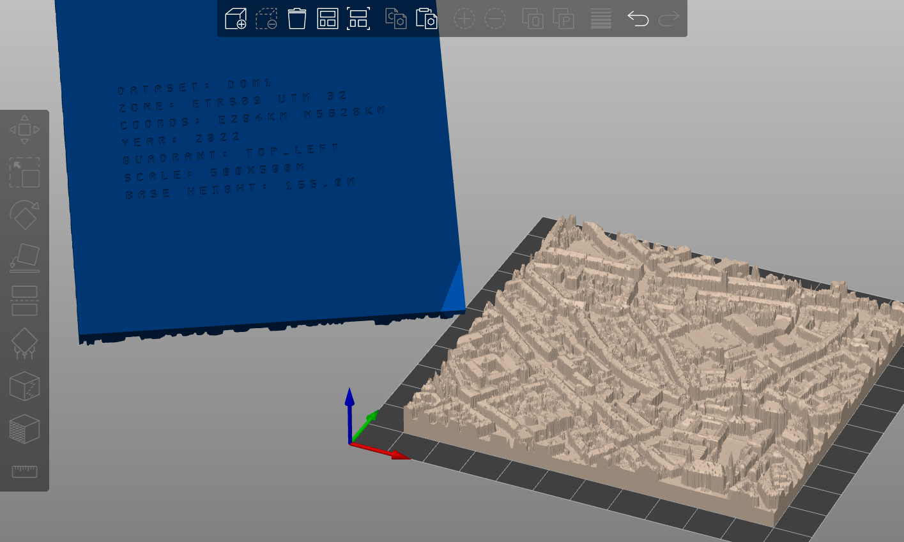

# TIFF to STL Converter

This program converts TIFF heightmaps to 3D STL files. The input is automatically subdivided into 4 quadrants, each saved as a separate STL file with identifying text labels.



## Features

- Converts TIFF heightmaps to 4 separate STL files (quadrants)
- Downloads heightmaps directly from OpenGeoData NRW using coordinates
- Preprocesses heightmaps to smooth out pixel errors
- Adds walls and bottom surfaces for 3D printing
- Embossed text labels at the bottom of each model showing:
  - Dataset information (DOM1, UTM zone, coordinates)
  - Year and quadrant section
  - Scale dimensions (e.g., 500x500m)
  - Base height
- Optional base height override for consistent printing

## Installation

### Setting up Virtual Environment

```bash
# Create virtual environment
python3 -m venv venv

# Activate virtual environment
# On Linux/Mac:
source venv/bin/activate
# On Windows:
venv\Scripts\activate

# Install dependencies
pip install -r requirements.txt
```

### Dependencies

- Pillow >= 9.0.0
- numpy >= 1.20.0
- numpy-stl >= 2.16.0
- requests >= 2.25.0

## Usage

### Download using coordinates (recommended)

```bash
python heightmap_to_stl.py coords <tile_east> <tile_north> [--year YEAR] [--base-height HEIGHT]
```

Examples:
```bash
# Download heightmap for center of Aachen
python heightmap_to_stl.py coords 294 5628

# With custom year and base height
python heightmap_to_stl.py coords 294 5628 --year 2022 --base-height 100
```

### Use local file

```bash
python heightmap_to_stl.py file input.tiff [--base-height HEIGHT]
```

### Options

- `--year`: Year of the dataset (default: 2022)
- `--base-height`: Override the base height in meters (useful for consistent 3D printing across multiple tiles)

## Output

The output STL files will be created in the current working directory and named after the input file or downloaded tile, e.g.:
- dom1_32_294_5628_1_nw_2022_top_left.stl
- dom1_32_294_5628_1_nw_2022_top_right.stl
- dom1_32_294_5628_1_nw_2022_bottom_left.stl
- dom1_32_294_5628_1_nw_2022_bottom_right.stl

Each file contains:
- 3D terrain surface from the heightmap
- Walls around the perimeter
- Bottom surface with embossed text labels
- Scale: 1 meter in real world = 1 millimeter in the model

## Coordinate System

The program uses ETRS89 UTM coordinates. The tile coordinates correspond to the lower-left corner of each 1km × 1km tile in the coordinate system.

## Caching

Downloaded files are cached in `~/.cache/aachen-3d/` to avoid unnecessary re-downloads.

## Deactivating Virtual Environment

```bash
deactivate
```
